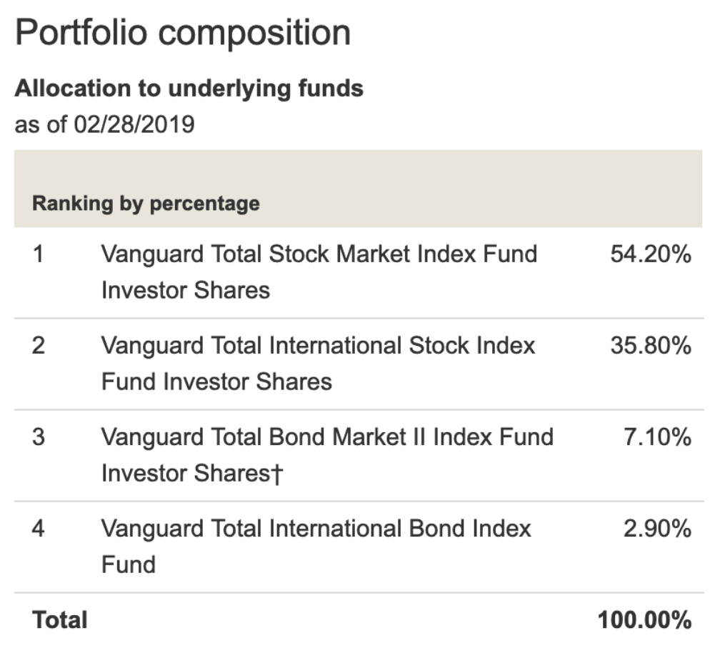

A friend recently asked me for advice on how to get started with investing their money. Here is a quick writeup I shared with him. Welcome any feedback at [@mericsson](https://twitter.com/mericsson).

---

## Intro

A basic belief I have is the theory put out by [A Random Walk Down Wall Street](https://en.wikipedia.org/wiki/A_Random_Walk_Down_Wall_Street): one cannot consistently outperform market averages. Therefore, any investments you make should seek to minimize cost. In addition, any investments you make should be done with tax efficiency in mind. And, lastly, you will need to consider your age & risk based asset allocation.

## Low Cost Investment Vehicles

The most famous (and my favorite) low cost investment vehicles are Index Mutual Funds offered by Vanguard. They can be acquired directly through Vanguard or via ETF in your brokerage of choice. Both options are fine.

## Tax Efficiency

### 401k 

Max it out if you have means to do so. At our age, put all the money into the stock market. I prefer a 60% domestic and 40% international ratio. I periodically rebalance to it to match that. I choose whichever index funds my 401k provider offer that have the lowest expense ratio.

### Roth IRA

If you qualify, max this out as well. Post taxed income can be contributed and it grows tax free until retirement. If you earn up to $122,000 you qualify for a full contribution, otherwise $122,000–$137,000 offers partial contribution.

## Asset Allocation

The closer you are to retirement (or to needing your funds) the more of your money should be in lower risk investments i.e. Bonds. One way to achieve this is to buy Target Date Funds e.g. [Vanguard Target Retirement 2050 Fund](https://investor.vanguard.com/mutual-funds/profile/VFIFX). Its allocation is:


Meaning it’s opinion is someone our age should have 90% in stocks and 10% in bonds. A good discussion on Target Date Funds can be found [here](https://www.bogleheads.org/wiki/Target_date_funds). I think it is a good option if you want to be completely hands off.

Personally, I prefer to buy and sell the underlying Index Funds (and other index funds) mainly for two reasons:

### 1. Tax Advantage
A wider variety / diversification of investments allows for more variety in gains / losses. Which means year-to-year you can more easily offset gains of one investment against the losses of a different investment.

### 2. Expense Ratios
I generally have not seen Target Retirement funds with expense ratios quite as good as holding the underlying funds. While this is not a great apple-to-apples comparison the Vanguard Target Retirement 2050 Fund has 0.15% expense ratio while Vanguard Total Stock Market Admiral has 0.04%. That small difference adds up over the years. 

## Summary

Given all that, here are a quick few steps to get investments in order:

1. Ensure 401k is invested properly in stock index funds.
2. After ensure you have enough cash available, move the rest (in a [time averaged way](https://en.wikipedia.org/wiki/Dollar_cost_averaging)) into low cost Index Funds (or their ETF counterparts). Allocation is up to you and your risk profile, but here is a potential allocation described below:

```
60% Vanguard Total Stock Market 
30% Vanguard Total International Stock Market
10% Vanguard Short-Term Bond Index Fund
```
  
